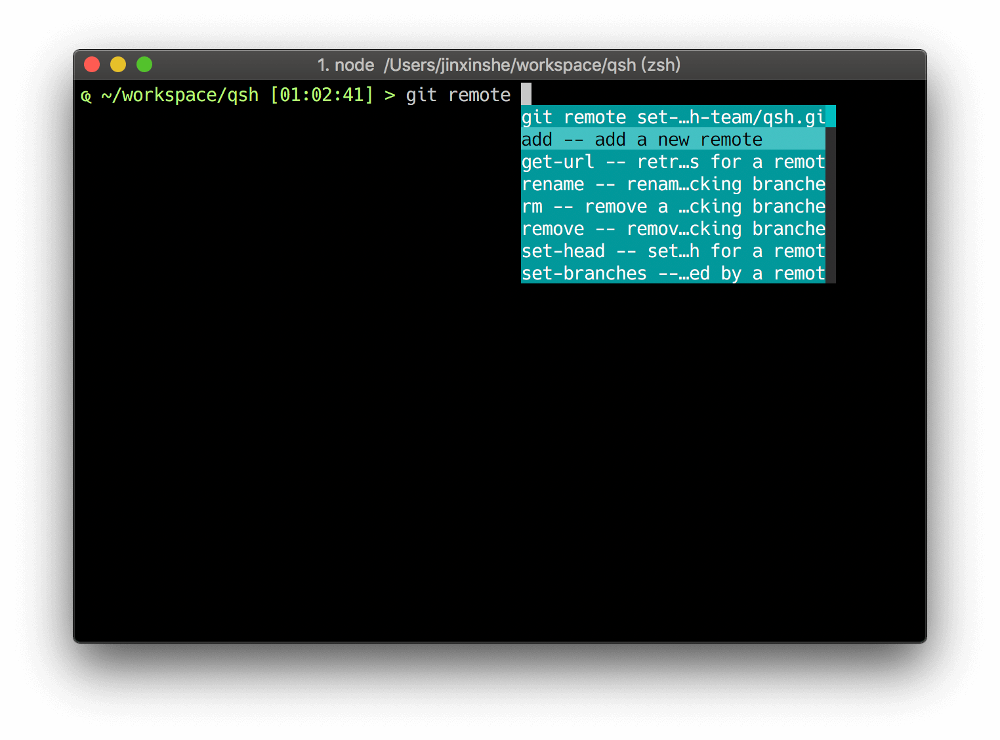

[](https://app.codeship.com/projects/eec620b0-97da-0137-fc7c-7acfd78361b8)

[](https://lgtm.com/projects/g/qsh-team/qsh/overview/)


## WIP

## Try

### Try with docker

```shell
git clone https://github.com/qsh-team/qsh
cd qsh
npm run docker:build
npm run docker:run
```


## Screenshot

